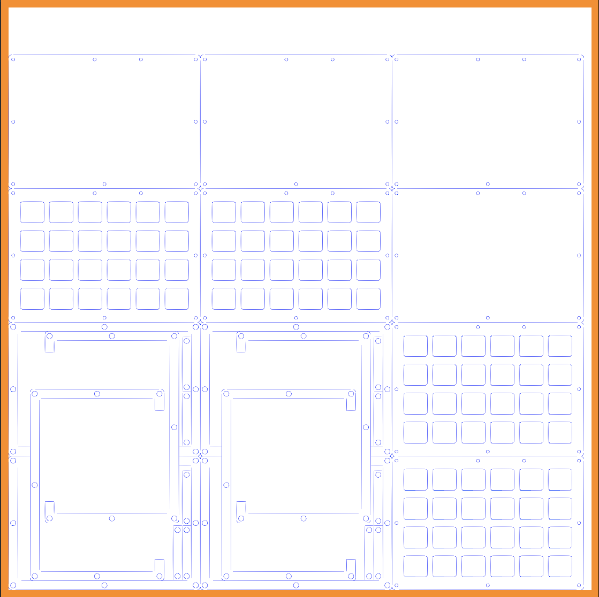

Let's Split V2 Case
===================

Here's my design files for the Let's Split V2. It's a sandwich-style case with cutouts at the back to accommodate the USB jack and the TRRS jack.

The design file has 4 top and bottom pieces and 8 middle layer pieces. This is only good for 1 whole case for 2 halves, and 1 case that has no middle layers (you'd need to use standoffs).

Pieces
------
There's 4 different types of pieces the case uses:

- Top/Switch layer - Each half uses 1 of these
- Bottom layer - Each half uses 1 of these
- Middle layer
    - C-shaped piece - Each half uses 3 of these, use a 4th one if you need more space (like when using a Pro Micro with Mini USB jack)
    - Stick piece - Same number as the C-Shaped piece

Screws and Standoffs
--------------------
This case was designed to use M2 screws and standoffs. The holes in the middle layers are for the standoffs, while the holes in the top and bottom layers are only wide enough for the screws. M2 screws and standoffs that fit the case can be purchased at Keebio: [M2 Screws & Standoffs](https://keeb.io/products/m2-screws-and-standoffs).

Ponoko
------
I used Ponoko to have the case cut and used a P2 sized 3mm acrylic sheet. The kerf of the files has been set to 0.15mm for use with Ponoko and Lasergist.

Case Images
-------------

### SVG file

### Assembled case

License
-------
These case files are released under the MIT License.

Contact Info
------------
I also go by bakingpy on Reddit and the MechKeys Discord server and can be reached through either.
